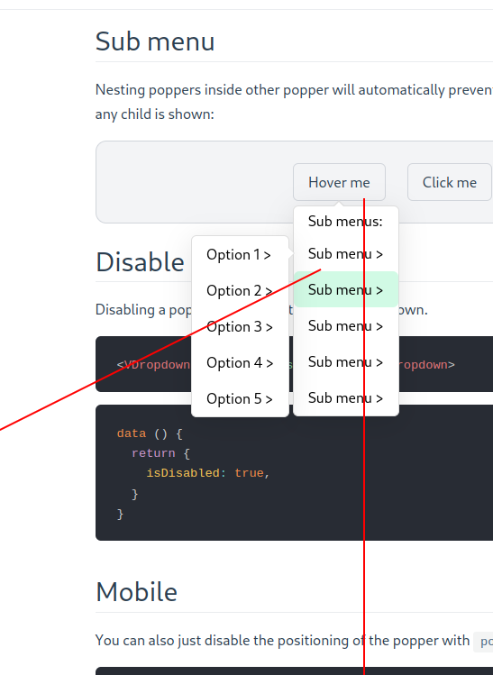

# Component

For more advanced use cases such as dropdowns, you can use the components instead of the `v-tooltip` directive.

## Dropdown

The most basic component included by default is the `VDropdown` component:

```vue
<VDropdown
  :distance="6"
>
  <!-- This will be the popover reference (for the events and position) -->
  <button>Click me</button>

  <!-- This will be the content of the popover -->
  <template #popper>
    <input class="tooltip-content" v-model="msg" placeholder="Tooltip content" />
    <p>
      {{ msg }}
    </p>

    <!-- You can put other components too -->
    <ExampleComponent char="=" />
  </template>
</VDropdown>
```

As shown in the above example, the popper content must be passed to the `popper` slot.

The `VDropdown` uses the `dropdown` theme.

<DropdownSimpleExample />

## Tooltip

If you want to display a tooltip with components and more advanced content, you can use the `VTooltip` component that uses the `tooltip` theme (just like the `v-tooltip` directive).

```vue
<VTooltip>
  <a>Sponsor me</a>

  <template #popper>
    Help me fund my Open Source work!
  </template>
</VTooltip>
```

<TooltipComponentExample />

## Hover Menu

There is a `VMenu` variant with the `menu` theme which extends the `dropdown` theme. It overrides `triggers` and `delay` to be usable on mouse over.

```vue
<VMenu>
  <button>Documentation</button>

  <template #popper>
    <button>Guide</button>
    <button>API Reference</button>
  </template>
</VMenu>
```

<MenuSimpleExample />

## Placements

The available placements are:

 - `'auto'`
 - `'auto-start'`
 - `'auto-end'`
 - `'top'`
 - `'top-start'`
 - `'top-end'`
 - `'right'`
 - `'right-start'`
 - `'right-end'`
 - `'bottom'`
 - `'bottom-start'`
 - `'bottom-end'`
 - `'left'`
 - `'left-start'`
 - `'left-end'`

<DropdownPlacement />

## Triggers

Triggering a popper means either showing it or hiding it. A trigger describes events that should toggle the popper visibility.

These are the available triggers:

- `click`
- `hover` (uses `mouseenter` and `mouseleave`)
- `focus` (uses `focus` and `blur`)
- `touch` (uses `touchstart` and `touchend`)

Those events will be listened on the elements in the default slot inside the popper component (the reference elements).

To customize how the popper is shown or hidden, use the `triggers` prop. It must be an array of triggers from the list above.

```vue
<VDropdown
  :triggers="['hover', 'focus']"
>
```

If you want to manually trigger the popper, use an empty array: `:triggers="[]"` and the `shown` prop:

```vue
<VDropdown
  :triggers="[]"
  :shown="isOpen"
  :autoHide="false"
>
```

::: tip
If `autoHide` is `true`, the popper will be hidden when clicked outside of it. That's why it's forced to `false` in the previous snippet.
:::

You can specify different triggers for the showing or hiding action of the popper with the `showTriggers`
 and `hideTriggers` props:

```vue
<VDropdown
  :showTriggers="['hover']"
  :hideTriggers="['click']"
>
```

Using functions allows you to reuse the `triggers` list:

```vue
<VDropdown
  :triggers="['focus']"
  :showTriggers="triggers => [...triggers, 'hover']"
  :hideTriggers="triggers => [...triggers, 'click']"
>
```

You can also use the `popperTriggers`, `popperShowTriggers` and `popperHideTriggers` props which will add the event listeners on the popper container itself (instead of the reference elements).

This can be useful if you want to popper to stay open when the mouse hovers it:

```vue
<VDropdown
  :triggers="['hover']"
  :popperTriggers="['hover']"
>
```

## Offset

Offsetting the popper means moving it relative to its computed position on the page. You can do this with the `distance` and `skidding` props.

This example will move the popper away from the reference by `64` pixels:

```vue
<VDropdown
  :distance="64"
>
```

<OffsetExample :offset="[0, 64]" info="(Distance)"/>

This example will move the popper `32` pixels alongside the reference:

```vue
<VDropdown
  :skidding="32"
>
```

<OffsetExample :offset="[32, 0]" info="(Skidding)"/>

You can also use negative value, since it's a relative offset.

```vue
<VDropdown
  :distance="32"
  :skidding="-16"
>
```

<OffsetExample :offset="[-16, 32]" info="(Negative skidding and positive distance)"/>

## Arrow padding

If you use tooltips that are positionned on the edge of the reference, you may need to specify an "arrow padding". This padding will prevent the arrow from glitch out of the tooltip:

```vue
<VDropdown :skidding="-32" />
```

<ArrowPadding />

To fix this, specify the `padding` option of the `arrow` modifier. In the following example, we prevent the arrow from going to the edges of the tooltip with a 8px limit:

```vue
<VDropdown
  :skidding="-32"
  :arrow-padding="8"
/>
```

<ArrowPadding :padding="8" />

## Hide from slot

Use the `hide` slot prop to close the popper:

```vue
<VDropdown>
  <button>Click me</button>

  <template #popper="{ hide }">
    <a @click="hide()">Close</a>
  </template>
</VDropdown>
```

## Close directive

Use the `v-close-popper` directive on an element inside the dropdown to close it when the element is clicked (or touched on mobile):

```vue
<VDropdown>
  <button>Click me</button>

  <template #popper>
    <a v-close-popper>Close</a>
  </template>
</VDropdown>
```

The directive works even in nested components in the `popper` slot.

You can also set it to true or false to enable or disable the directive (enabled by default):

```vue
<a v-close-popper="false">Close</a>
<a v-close-popper="true">Close</a>
```

You can also use a property:

```vue
<a v-close-popper="myBooleanProp">Close</a>
```

```js
data () {
  return {
    myBooleanProp: true,
  }
}
```

Close all the poppers in the page with the `all` modifier:

```vue
<a v-close-popper.all>Close All</a>
```

## Sub menu

Nesting poppers inside other popper will automatically prevent the parents from hiding when any child is shown:

<SubMenuExample />

Floating Vue will automatically fix the [diagonal submenu problem](https://www.google.com/search?q=submenu%20diagonal%20problem) for you by detecting if the mouse is aiming at the popper content from the reference:

<div class="mx-auto" style="max-width:400px">
  
</div>

After a one second delay, the lock applied because of aiming will expire.

## Disable popper

Disabling a popper will prevent it from being shown.

```vue
<VDropdown :disabled="isDisabled"></VDropdown>
```

```js
data () {
  return {
    isDisabled: true,
  }
}
```

## Mobile

You can also just disable the positioning of the popper with `positioningDisabled`:

```vue
<VDropdown :positioning-disabled="isMobile"></VDropdown>
```

It can for example be useful on the mobile version of your app if you want to apply a fixed position to the popper with CSS.

<DropdownMobileDemo />

```vue
<script>
let count = 0

export default {
  data () {
    return {
      isMobile: false,
    }
  },

  methods: {
    onShow () {
      if (count === 0) {
        document.body.classList.add('no-scroll')
      }
      count++
    },

    onHide () {
      count--
      if (count === 0) {
        document.body.classList.remove('no-scroll')
      }
    },
  },
}
</script>

<template>
  <div class="example">
    <label>
      <input v-model="isMobile" type="checkbox">
      Is mobile
    </label>

    <VDropdown
      :positioning-disabled="isMobile"
      @apply-show="isMobile && onShow()"
      @apply-hide="isMobile && onHide()"
    >
      <button>Click me</button>

      <template #popper="{ hide }">
        <div>This is awesome!</div>
        <button v-if="isMobile" @click="hide()">Cancel</button>
      </template>
    </VDropdown>
  </div>
</template>

<style>
body.no-scroll {
  overflow: hidden;
}

.v-popper__popper--no-positioning {
  position: fixed;
  z-index: 9999;
  top: 0;
  left: 0;
  width: 100%;
  height: 100%;
  display: flex;
  align-items: flex-end;
}

.v-popper__popper--no-positioning .v-popper__backdrop {
  display: block;
  background: rgba(0 0 0 / 90%);
}

.v-popper__popper--no-positioning .v-popper__wrapper {
  width: 100%;
  pointer-events: auto;
  transition: transform .15s ease-out;
}

.v-popper__popper--no-positioning.v-popper__popper--hidden .v-popper__wrapper {
  transform: translateY(100%);
}
</style>
```
